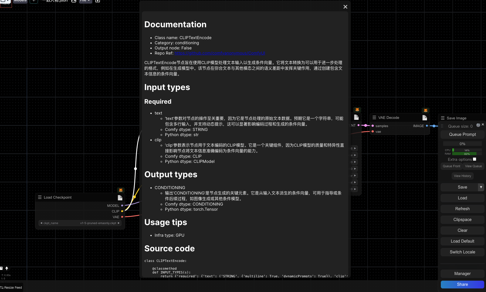

<!-- markdownlint-disable -->

  

<h1 align="center">comfyui-nodes-docs</h1>
<h4 align="center">Documentation plugin for 1900+ comfyui nodes ✨ / 1900+ComfyUI节点文档✨</h4>

<!-- markdownlint-restore -->

中文文档｜ [English Document](README_en.md)

这是一个用于显示1900+comfyui节点文档的插件。

## 安装

### comfyUI Manager

在comfyUI管理器中搜索`comfyui-nodes-docs`并安装。

### 自定义安装

- 在ComfyUI的插件目录中打开cmd窗口，例如"ComfyUI\custom_nodes"，输入`git clone https://github.com/CavinHuang/comfyui-nodes-docs` 或下载zip文件并解压，将生成的文件夹复制到ComfyUI\custom_ Nodes\

- 重新启动ComfyUI

### comfy-cli

- 如果你已经安装过comfy-cli，可以直接在终端中输入`comfy node registry-install comfyui-nodes-docs`，然后重启ComfyUI即可。

## 节点列表
- 整理中

## 参与共建

### 两个方面：

- 参与插件的维护，修复问题，提升使用体验，优化代码

- 参与节点文档的建设，新增还未收录的节点文档，修改已有节点文档中不正确的地方，或者因为插件升级导致的文档滞后问题。

### 参与方式如下：

- Fork一份代码到你的github中

- 创建一个新的分支用于修改你的变化，在你的仓库中完成你所有的变化，并且提交。

- 创建一个Pull Request，提交你的变化分支合并申请到main分支

- 通过审核后，将会发布你的代码到最新的main分支，公众将可以使用你提交的特性。

### 提交新的待适配文档的节点

如果你有需要待添加文档的节点，自己无法独自完成，你也可以在issue 或者 [comfyui节点文档待补充收集表](https://g4je62387v.feishu.cn/sheets/PinRs9EblhFUbDteDP6cHI5UngF?from=from_copylink)中提交，我们会尽快添加。

### 添加新的节点文档

- 在`docs`文件夹中创建一个以`节点类型`命名的Markdown文件，例如`CLIPMergeSimple.md`

- 在文件中添加以下结构，请参考具体示例[CLIPMergeSimple.md](docs/CLIPMergeSimple.md)：

<pre><code>
# Documentation
- Class name: Node name
- Category: Node category
- Output node: False
- Repo Ref: https://github.com/xxxx

Description of nodes

# Input types

Node input types

# Output types

Node output types

# Usage tips
- Infra type: GPU

# Source code

Node source code
</code></pre>

## 更新日志

### 2024-07-04
 - 本次更新节点文档1400+，总节点文档目前已经3500+，主要更新：ComfyUI-MotionDiff/KJNodes/Inspire-Pack/controlnet_aux/efficiency/rgthree/was-node-suite等节点的文档补充

### 2024-06-14
- 修复了文档中的一些错误
- 更新了layerStyle大部分文档

### 2024-06-11
- 修复了文档中的一些错误
- 更新了ComfyUI-AnimateDiff-Evolved/ComfyUI-Custom-Scripts大部分文档，补充了ComfyUI-VideoHelperSuite的部分节点文档

### 2024-05-26
- 修复了文档中的一些错误
- 更新了很多节点文档，可查看文档目录

### 2024-05-25
- 在设置中增加了开关，可以选择是否显示节点的文档
- 增加文档本地修改功能，如果觉得文档有问题，可以在本地修改，不会影响到其他人
- 在设置中增加了是否参与共建的开关，可以选择是否参与共建，默认打开，打开后会把本地修改的记录，记录到云DB上，后期经过审核后会合并到主分支上
- 增加导出文档和导入文档功能，导出文档会把本地修改的记录和仓库提供的文档导出下载，导入文档会把导出的文档导入到本地，不会影响主仓库的文档。
- 修复了一些bug

## 支持我

- 放空的记忆